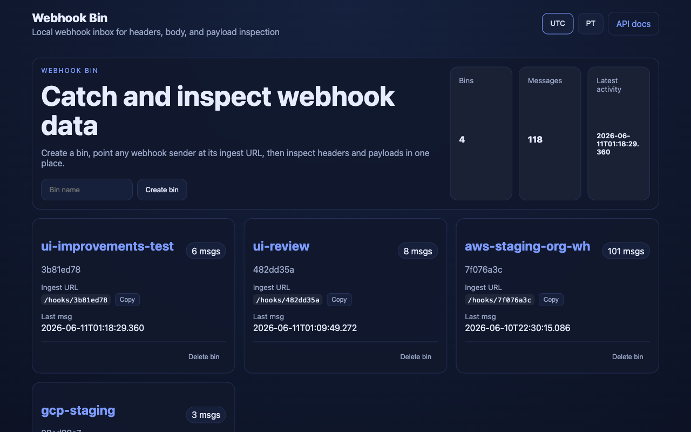
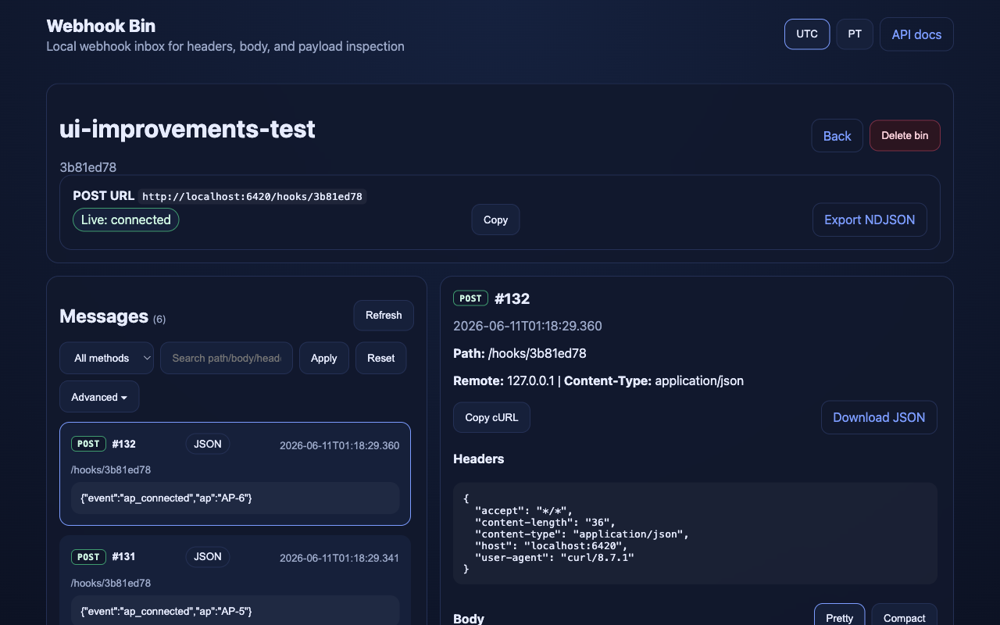

# Webhook Bin

A local-first webhook inbox for inspecting webhook payloads, headers, and
traffic — like a self-hosted webhook.site you can run on your laptop or a
Raspberry Pi.

Create a bin, point any webhook sender at its ingest URL, then read the headers
and parsed body in a live dashboard.

## Screenshots

**Home** — bins overview with live totals and per-bin ingest URLs:



**Bin dashboard** — message list on the left, full headers + body on the right:



## Features

- Unique ingest URL per bin, backed by SQLite
- Live message updates (SSE) with polling fallback
- Search / filter + cursor pagination
- HTTP method color-coding and JSON pretty/compact view
- Export to JSON, NDJSON, or a replay cURL command
- UTC / PT timestamp toggle
- Optional HMAC signature verification
- Optional retention policy (by age and/or message count)
- JSON API + Prometheus `/metrics`

## Quickstart

```bash
python -m venv .venv
source .venv/bin/activate
pip install -e .
webhook-bin
```

Open:

- UI — http://127.0.0.1:8000/
- API docs — http://127.0.0.1:8000/docs

Then send a test webhook:

```bash
curl -X POST http://127.0.0.1:8000/hooks/<bin_id> \
  -H 'content-type: application/json' \
  -d '{"hello":"world"}'
```

## Usage

1. Open the dashboard and create a bin.
2. Copy its ingest URL (`/hooks/<bin_id>`).
3. Point a webhook sender at it (or use the `curl` above).
4. Inspect headers and body in the bin dashboard.

## Tests

```bash
pip install -e '.[test]'
pytest --cov=webhook_bin --cov-report=term-missing
```

## Data

SQLite lives at `data/webhook_bin.db`. Delete the file to reset the app, or use
`webhook-bin backup` / `webhook-bin restore` (see the API docs).

## Documentation

- [Configuration](docs/configuration.md) — environment variables
- [API reference](docs/api.md) — endpoints + `curl` examples
- [Deployment](docs/deployment.md) — Raspberry Pi, systemd, auto-update
- [Public access](docs/public-access.md) — tunnel options (Cloudflare, ngrok)
- [Implementation](docs/implementation.md) — architecture + data model
